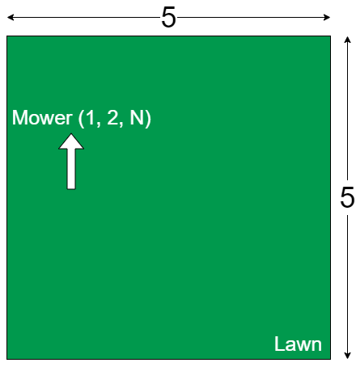

# Lawn Mower

[](https://codecov.io/gh/Amraneze/lawn-mower)


A program to mow your lawn with your own commands.

## Specification

Mowers can be programmed to move throughout the entire surface. A mower's position is
represented by Cartesian coordinates `(X, Y)`, and an orientation `(N, E, W, S)`. The lawn is
divided into a grid to simplify navigation.

>For example, the position `0,0,N` indicates the mower is in the lower left corner of the lawn facing
north.

To move the mower, we use a series of a combination of the following commands: `L, R, and F`.
`L` and `R` turn the mower 90 ° left or right without moving the mower. `F` means move forward one
space in the direction the mower is currently facing without changing its orientation.
If a forward movement would cause the mower to move outside of the lawn, the mower remains
in the position and this command is discarded. The position directly to the north of `(X, Y)` is `(X, Y + 1)` and the position to the east of `(X, Y)` is `(X + 1, Y)`.

The mowers are programmed using an input file constructed in the following manner:

The first line corresponds to the upper right corner of the lawn. The bottom left corner is
implicitly `(0, 0)`.
The rest of the file describes the multiple mowers that are on the lawn. Each mower is described
on two lines:

- The first line contains the mower's starting position and orientation in the format `X Y O`. `X` and
`Y` are the coordinates and `O` is the orientation.
- The second line contains the instructions for the mower to navigate the lawn. The instructions
are not separated by spaces.
- At the end of the simulation, the final position and orientation of each mower is output in the
order that the mower appeared in the input.

Example of a mower command: 
```
5 5
1 2 N
LFLFLFLFF
```


## Getting Started

### Prerequisites

#### Sbt

* Memory: At least 128MB
* Operating System: Any operating system.
* Disk Space: At least 124MB (for JRE) of available disk space.

#### Docker

* Memory: At least 2GB
* Operating System: Linux kernel version 3.10 or higher, Windows x Pro/Ent x64.
* Disk Space: 3GB of available disk space (For docker images and builds).

> NOTE: You may find all the details in the following page [Docker System requirements](https://docs.docker.com/datacenter/ucp/1.1/installation/system-requirements/)

### Installation

#### Sbt
**You can follow this link [Install Sbt](https://www.scala-sbt.org/release/docs/Setup.html) to install Sbt**

#### Docker
**You can follow this link [Install Docker](https://docs.docker.com/install/) to install Docker**
>Note: This workshop is tested with Docker Desktop Community Edition `2.5.0.0 (49427)` running on Docker engine `19.03.13` on `Win 10 Pro Version 2004 Build 19041.572`.

## Running the project

### With SBT
From the root directory of the project, you can:

#### Compile the project:
```
sbt compile
```

#### Run the Main App:
You have two ways to run the application, either with a string that contains the data or a file path.
>Note: I would recommend you to use a file path to not encounter any issue. 

##### with commands as argument
```
sbt run --commands "commands"
```
>Note: If you use sbt run without argument you will have an exception thrown with an example of the command that needs to be run with the App.

For example you can try:
On a Unix based system:
```
sbt "run --commands \"5 5\\\n1 2 N\\\nLFLFLFLFF\\\n3 3 E\\\nFFRFFRFRRF\""
```
On a Window system:
```
sbt "run --commands ""5 5\\n1 2 N\\nLFLFLFLFF\\n3 3 E\\nFFRFFRFRRF"""
```
or on your sbt shell
```
run --commands "5 5\\n1 2 N\\nLFLFLFLFF\\n3 3 E\\nFFRFFRFRRF"
```
And you will get this result displayed in your terminal
```
1 3 N
5 1 E
```

##### with file path as argument
```
sbt run --file filepath
```
>Note: If you use sbt run without argument you will have an exception thrown with an example of the command that needs to be run with the App.

For example you can try:
```
sbt "run --file /tmp/mower-commands.txt"
```
or on your sbt shell
```
run --file /tmp/mower-commands.txt
```
And you will get this result displayed in your terminal
```
1 3 N
5 1 E
```

#### Run the test cases
##### Unit test
```
sbt test
```

##### Integration test
```
sbt it:test
```

### With Docker
After installing Docker and you want to run the project you can just run the following command:

>Note: You should be in root of the folder to execute these commands

you can use this bash script to take care of running docker containers:

#### providing commands as a string
>Note: Do not use, it's still in progress, maybe I need to change the way I parsed the string
```
./run.sh -commands "5 5\\\n1 2 N\\\nLFLFLFLFF\\\n3 3 E\\\nFFRFFRFRRF"
```
#### providing a commands as a filepath
```
./run.sh -file ./mower-commands.txt
```
>Note: The file should be in the context of Docker otherwise, it won't copy the fail and throw an error, or you can mount a volume in docker-compose